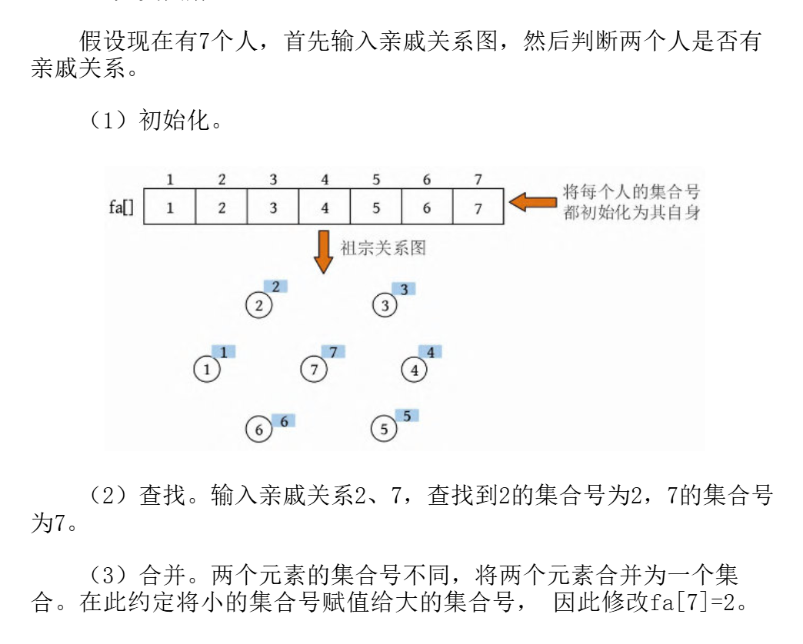

# 并查集 (Union-Find)

**言简意赅，并查集是一种支持“集合合并”和“查询某元素属于哪个集合”的数据结构，主要用于解决**：

> 「动态连通性」问题 —— 判断两个元素是否属于**同一组、同一个网络或系统中是否联通。**

用高中的部分知识来讲，判断**两个元素**是否在**同一个集合**。

例如：查询是否属于亲戚关系

## Union-Find 大致内容
```
并查集 = 动态连通性 + 高效合并与查找
       ├── find(x) + 路径压缩
       ├── union(x, y) + 按秩合并
       └── 场景：图论、社交、网络、图像处理、用户数据合并
```

当然在我们的习题中，会不断的有此类型（并查集）的变种且不断加强。

[并查集（模板）](https://www.luogu.com.cn/problem/P3367)

**带权并查集**：每个集合间有某种权值（如距离、代价、关系深度），合并或查找时需要更新权值。 [**NOIP-2017-奶酪**](https://www.luogu.com.cn/problem/P3958)

**可撤销并查集**（可用于回溯型问题）

**持久化并查集**（用于版本管理）

## 代码解析

```cpp
int fa[N];  // fa[x] 表示 x 的父节点

int find(int x) {
    if (fa[x] != x)
        fa[x] = find(fa[x]); 
    return fa[x];
    //等效代码：
    // return fa[x] = fa[x] == x ? x : find(fa[x]);
}

void Union(int x, int y) {
    int a = find(x), b = find(y);
    if (a != b) fa[a] = b;
}

void init() {
    for(int i = 1; i <= n; ++ i) fa[i] = i; //初始化，首先让所有节点都初始为自身
}
```

```
fa[] = {1, 2, 3, 4, 6, 7};
```

并查集三部曲：
> 1. 初始化 → 每个节点是自己爸爸
> 2. 查找根 → 递归找爸爸并路径压缩
> 3. 合并根 → 找到两个根，连起来





> 引用 《算法训练营》并查集章节-该图仅学习与参考，助理解。